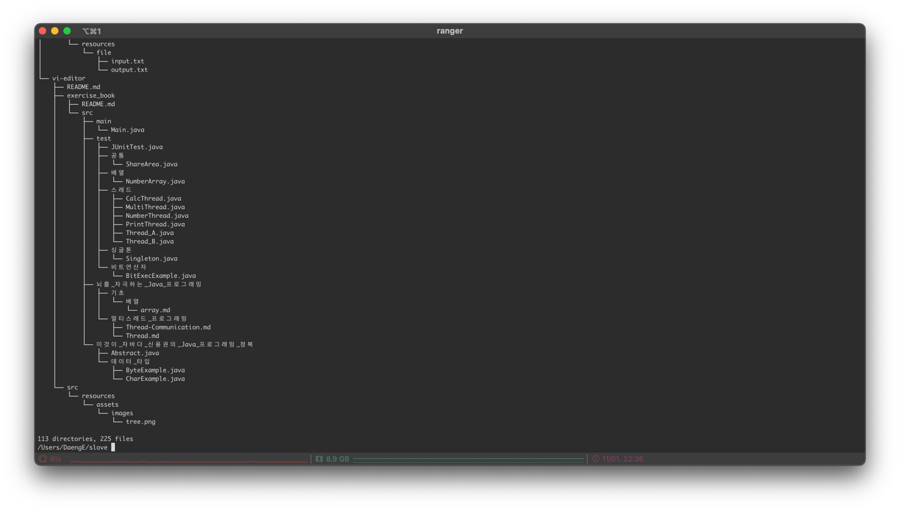
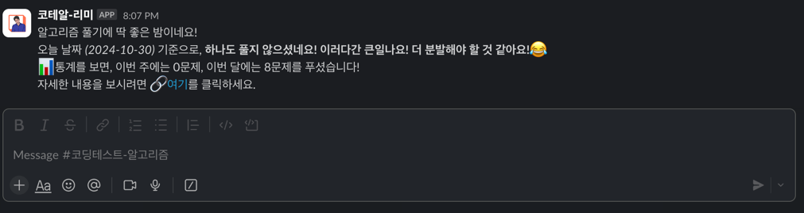

<div align="center">

# 백준 알고리즘


</div>

### ✏️작성 취지
- 알고리즘 해결과정 및 고충 정리
- 파일 이력관리
- 빠른 디버깅, 실행 결과 도출
- 자료구조 공부 (Iterator, Map, Stream)
- 깔끔한 주석 템플릿

### 📊 현재 통계
> 2026-09-08 기준 저장소를 직접 분석해서 산출한 값입니다. 커밋을 쌓을 때마다 달라지니 참고용으로만 봐주세요.

- 전체 커밋: **191개** (첫 커밋 2024-03-13 ~ 최근 커밋 2025-07-14)
- 풀이한 자바 파일: **총 82개**

| 카테고리 | 경로 | 문제 수 |
|---|---|---|
| 수학 | `baekjoon/math` | 35 |
| 구현 | `baekjoon/Implementation` | 32 |
| 스택 | `baekjoon/stack` | 2 |
| 문자열 | `baekjoon/string` | 1 |
| 정렬 | `baekjoon/sort` | 1 |
| 누적합 | `baekjoon/prefix_sum` | 1 |
| 다이나믹 프로그래밍 | `baekjoon/dynamic_programming` | 1 |
| 임의 정밀도 | `baekjoon/arbitrary_precision` | 1 |
| 재귀 (알고리즘 공부) | `algorithm/recursion/*` | 4 |
| 정렬 알고리즘 학습 | `bjpublic/javarithms/sort` | 4 |

> 수학·구현 카테고리에 82개 중 67개(약 82%)가 몰려 있어요. 그래프/그리디/BFS·DFS 등 아직 없는 카테고리를 늘리는 쪽으로 다음 목표를 잡아보면 좋을 것 같습니다.

### 💻구성
- Java JDK 8 ( corretto 1.8 )
- Server IntelliJ Local Machine -> Edit Configuration -> Build and run modify options -> Redirect Input & save console to output file
- Gitkraken
- ~~Gradle~~
- ~~SpringBoot2.x.x~~
- ~~Swagger UI~~
- Slack & Incoming WebHooks API (GitHub Actions로 자동 발송)

### 🗂️폴더 구조
실제 저장소 구조를 기준으로 다시 정리했습니다. (기존 README의 `baekjoon/category/$_1` 표기는 실제 경로와 달라서 맞게 고쳤습니다.)

```
src/com/test/coding/
├── baekjoon/                  # 백준 문제 풀이 (카테고리별 분류, $_문제번호.java)
│   ├── math/
│   ├── Implementation/
│   ├── stack/
│   ├── string/
│   ├── sort/
│   ├── prefix_sum/
│   ├── dynamic_programming/
│   └── arbitrary_precision/
├── algorithm/recursion/       # 알고리즘 개념 공부 (재귀)
│   └── array/ · binarySearch/ · sequentialSearch/ · string/
└── bjpublic/javarithms/sort/  # 정렬 알고리즘 학습 (Bubble/Insertion/Merge/Selection)
```

- 서브모듈을 활용하여 메인 저장소는 이 곳이 되고 그 다음 저장소는 vi-editor 가 되고 그 다음 서브 모듈은 exercise_book 이다.
- **slove -> vi-editor -> exercise_book**
- 
- ⚠️ `vi-editor`는 서브모듈이라 일반 `git clone`만으로는 빈 폴더로 보입니다. 내용까지 받으려면 `git clone --recurse-submodules` 또는 `git submodule update --init --recursive`가 필요합니다.

### 👨‍💻구현 방식
1. 백준 알고리즘에서 제시한 입력 데이터를 input.txt 입력
2. 코딩
3. 올바른 값이 output.txt 출력되었는지 확인

### 🔔 자동 알림 (Slack)
GitHub Actions로 두 가지 알림을 자동 발송합니다. (`.github/workflows/`)

| 워크플로우 | 주기 | 내용 |
|---|---|---|
| `daily-algorithm-alert.yml` | 월~금, KST 오후 8시 | 어제 푼 문제 수 + 이번 주/이번 달 누적 |
| `weekly-algorithm-alert.yml` | 매주 금요일, KST 오후 6시 | 최근 6개월 누적 통계 |

- 두 워크플로우 모두 `secrets.SLACK_WEBHOOKS_URL` (Incoming Webhook)로 메시지를 보냅니다. Slack 쪽에서 Webhook을 재발급했다면 저장소 Settings → Secrets and variables → Actions에서 값을 갱신해야 합니다.
- **Actions 탭에서 `Run workflow` 버튼으로 수동 실행/테스트가 가능하도록 두 워크플로우에 `workflow_dispatch` 트리거를 추가했습니다.** 스케줄을 기다리지 않고 바로 알림이 오는지 확인할 수 있습니다.
- GitHub은 저장소에 **60일 이상 커밋 활동이 없으면 예약(cron) 워크플로우를 자동으로 비활성화**합니다. 최근 커밋 이후 시간이 많이 지나서 알림이 끊긴 것이라면, 커밋을 새로 쌓는 것만으로는 다시 켜지지 않고 **Actions 탭 → 해당 워크플로우 → `Enable workflow` 버튼을 직접 눌러줘야** 합니다. 지금 알림이 안 오는 문제의 가장 유력한 원인으로 보입니다.

### ⚠️주의사항
- 문제를 대충 보지 않는다.
- **입출력**을 정확하게 이해한다.
- 어떻게 **구현**해야 할지 생각한다.
- **오탈자**를 확인한다.
- 예외를 처리한다.
- **디버깅**을 한다.

- **반례**를 스스로 찾아낼 수 있어야한다.
- 한 문제에 **많은 시간**을 할애하지 않는다.
  - 하지만, 포기하지 않고 충분히 고민은 해본다. 남들이 구현한 방식을 참고하는 것도 중요하다. 똑같이는 구현하지 않고 최대한 개성있고 최적화하여 가독성이 좋도록 한다.
  - 현재 한 문제에 가장 오래걸린 시간은 **2일**이다.
- 다양한 접근방식을 생각한다. 너무 깊게도 얇게도 생각하지 않는다. 예상외에 답이 나올 수 있는 방법이 있다.

### 📋추가 예정
- [X] ~~AWS EC2 인스턴스를 이용하여 Docker-compose 설치~~
- [X] ~~Docker 컨테이너를 이용하고 App을 외부에서 접근이 가능하도록 구현~~
- [X] 알고리즘 풀이 주간, 월간 통계・결산하여 알림 서비스
- [ ] 그래프/그리디/BFS·DFS 카테고리 풀이 추가 (현재 수학·구현에 82% 편중)
- [ ] `weekly-algorithm-alert.yml`의 cron 시간 주석(오후 8시)과 실제 실행 시각(오후 6시) 불일치 정리



---

### 🔍 이번 점검에서 발견/수정한 이슈
- **(수정) weekly 워크플로우 통계 오류**: `weekly-algorithm-alert.yml`의 checkout 단계에 `fetch-depth: 0`이 빠져 있었음. GitHub Actions 기본 checkout은 최신 커밋 1개만 가져오는 얕은 클론이라, `cal-months-algorithm-slove.sh`가 `git log --follow`로 파일별 최초 커밋일을 조회할 때 대부분 실패 → 6개월 누적 통계(`FIRST_COMMIT_COUNT`)가 실제보다 적게 집계됐을 가능성이 높음. `daily-algorithm-alert.yml`에는 이미 이 옵션이 있었는데 weekly에는 누락되어 있었음. → daily와 동일하게 추가함.
- **(수정) 오래된 저장소 이름 링크**: 일간 Slack 메시지의 "깃허브 리포지토리 바로가기" 링크가 이전 저장소 이름인 `baekjoon-slove`를 가리키고 있었음. GitHub 리다이렉트 덕분에 지금 당장은 열리지만, 현재 이름인 `baekjoon-algorithm-slove`로 직접 가리키도록 고침.
- **(참고, 미수정) weekly cron 주석 불일치**: 코드상 `cron: '0 9 * * 5'`는 KST 오후 6시에 실행되는데, 주석에는 "8 PM"이라고 적혀 있음. 의도한 시각이 6시인지 8시인지 몰라서 스케줄 자체는 건드리지 않음. 8시가 맞다면 `'0 11 * * 5'`로 바꾸면 됨.
- **(참고) 알림이 안 갈 수 있는 또 다른 원인**: `SLACK_WEBHOOKS_URL` 시크릿 자체가 만료/삭제되었을 가능성도 있음. Slack Incoming Webhook은 앱을 워크스페이스에서 제거하거나 워크스페이스를 바꾸면 URL이 무효화됨. Actions 탭에서 `workflow_dispatch`로 수동 실행해보면 어느 쪽 문제인지(스케줄 비활성화 vs URL 만료) 바로 구분할 수 있음.
